## Chapter 1

[Step 1: ](SAP Cloud ALM Teched-40: Log On - Google Chrome)

\(1\) A text is entered in the  text field.

[Step 2: ](SAP Cloud ALM Teched-40: Log On - Google Chrome)

\(1\) A text is entered in the  text field.

[Step 3: ](SAP Cloud ALM Teched-40: Log On - Google Chrome)

\(1\) Click  .

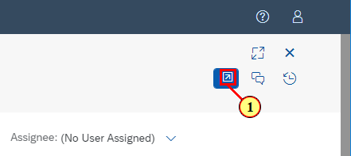

[Step 4: ](Home - Google Chrome)

\(1\) Click  .

[Step 5: ](Overview - Google Chrome)

\(1\) Click  .

[Step 6: ](Overview - Google Chrome)

\(1\) Click  .

[Step 7: ](Overview - Google Chrome)

\(1\) Click  .

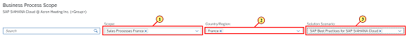

[Step 8: ](Project - Google Chrome)

\(1\) Click  .

[Step 9: ](Project - Google Chrome)

\(1\) Drag  .

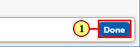

[Step 10: ](Project - Google Chrome)

\(1\) Drop on  .

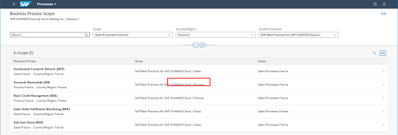

[Step 11: ](Project - Google Chrome)

\(1\) A text is entered in the  text field.

[Step 12: ](Project - Google Chrome)

\(1\) Click  .

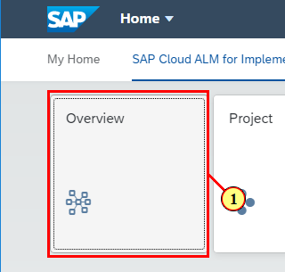

[Step 13: ](Project - Google Chrome)

\(1\) Click  .

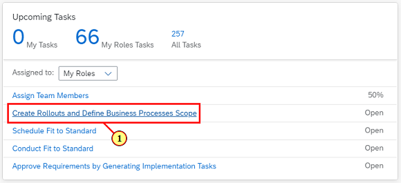

[Step 14: ](Project - Google Chrome)

\(1\) Click  .

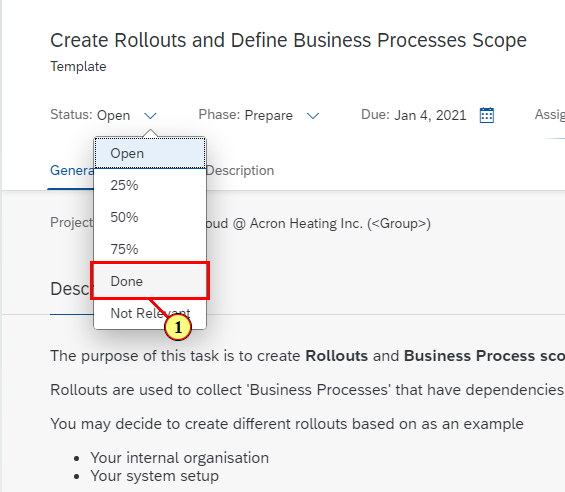

[Step 15: ](Project - Google Chrome)

\(1\) Click  .

[Step 16: ](Project - Google Chrome)

\(1\) Click  .

[Step 17: ](Project - Google Chrome)

\(1\) Click  .

[Step 18: ](Project - Google Chrome)

\(1\) Click  .

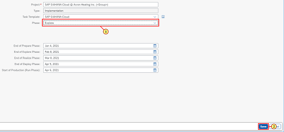

[Step 19: ](Project - Google Chrome)

\(1\) Click  .

[Step 20: ](Project - Google Chrome)

\(1\) Click  .

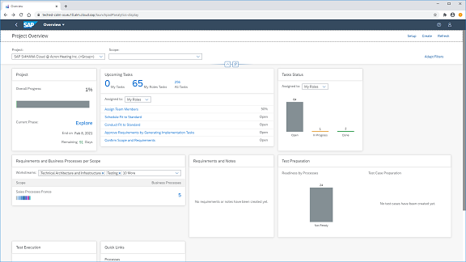

[Step 21: ](Project - Google Chrome)

\(1\) Click  .

[Step 22: ](Project - Google Chrome)

\(1\) Click  .

[Step 23: ](Project - Google Chrome)

\(1\) A text is entered in the  text field.

[Step 24: ](Project - Google Chrome)

\(1\) Click  .

[Step 25: ](Project - Google Chrome)

\(1\) A text is entered in the  text field.

[Step 26: ](Project - Google Chrome)

\(1\) Click  .

[Step 27: ](Project - Google Chrome)

\(1\) Click  .

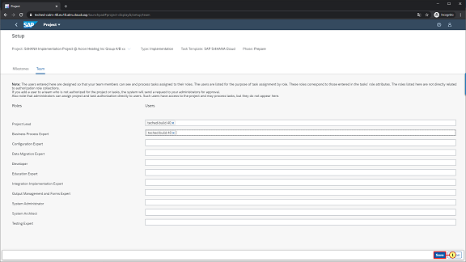

[Step 28: ](Project - Google Chrome)

\(1\) Click  .

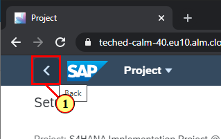

[Step 29: ](Overview - Google Chrome)

\(1\) Click  .

[Step 30: ](Overview - Google Chrome)

