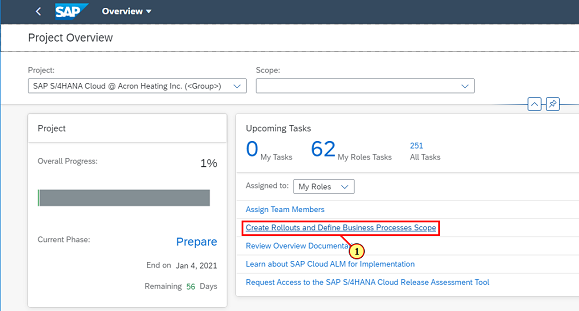
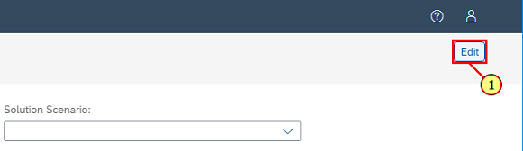
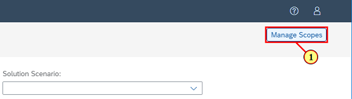
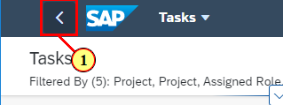
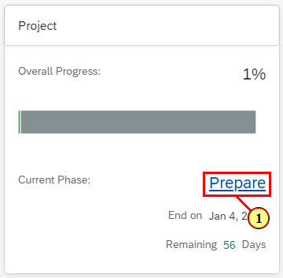
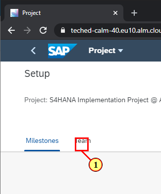
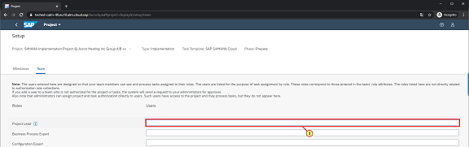
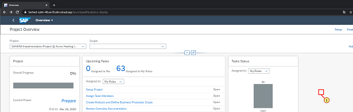

## Test Steps Parameter \- Creation and usage in Test Steps test cases

[ACCORDION-BEGIN [Step 1: ](Home - Google Chrome)]

\(1\)  **Open ** the  *Test Steps Parameters * app.

[ACCORDION-END]

[ACCORDION-BEGIN [Step 2: ](Test Steps Parameters - Google Chrome)]

\(1\) Open the area  to  **maintain groups of parameters** . Groups are used to structure the Test Steps Parameters.

[ACCORDION-END]

[ACCORDION-BEGIN [Step 3: ](Test Steps Parameters - Google Chrome)]

\(1\) Click   to ** create ** a ** new group ** of parameters.

[ACCORDION-END]

[ACCORDION-BEGIN [Step 4: ](Test Steps Parameters - Google Chrome)]

\(1\)  **Enter ** a  *Group ID* ; it is limited to 10 characters.

[ACCORDION-END]

[ACCORDION-BEGIN [Step 5: ](Test Steps Parameters - Google Chrome)]

\(1\) Enter a  *Group Label* .

[ACCORDION-END]

[ACCORDION-BEGIN [Step 6: ](Test Steps Parameters - Google Chrome)]

\(1\) Click   to create a new group.

[ACCORDION-END]

[ACCORDION-BEGIN [Step 7: ](Test Steps Parameters - Google Chrome)]

\(1\) Click  .

[ACCORDION-END]

[ACCORDION-BEGIN [Step 8: ](Test Steps Parameters - Google Chrome)]

\(1\) A text is entered in the  text field.

[ACCORDION-END]

[ACCORDION-BEGIN [Step 9: ](Test Steps Parameters - Google Chrome)]

\(1\) Click  .

[ACCORDION-END]

[ACCORDION-BEGIN [Step 10: ](Test Steps Parameters - Google Chrome)]

\(1\) Click  .

[ACCORDION-END]

[ACCORDION-BEGIN [Step 11: ](Test Steps Parameters - Google Chrome)]

\(1\) Click  .

[ACCORDION-END]

[ACCORDION-BEGIN [Step 12: ](Test Steps Parameters - Google Chrome)]

\(1\) Click  .

[ACCORDION-END]

[ACCORDION-BEGIN [Step 13: ](Home - Google Chrome)]

\(1\) Click  .

[ACCORDION-END]

[ACCORDION-BEGIN [Step 14: ](Test Steps Designer - Google Chrome)]

\(1\) Click  .

[ACCORDION-END]

[ACCORDION-BEGIN [Step 15: ](Test Steps Designer - Google Chrome)]

\(1\) A text is entered in the  text field.

[ACCORDION-END]

[ACCORDION-BEGIN [Step 16: ](Test Steps Designer - Google Chrome)]

\(1\) Click  .

[ACCORDION-END]

[ACCORDION-BEGIN [Step 17: ](Test Steps Designer - Google Chrome)]

\(1\) Click  .

[ACCORDION-END]

[ACCORDION-BEGIN [Step 18: ](Test Steps Designer - Google Chrome)]

\(1\) Drag  .

[ACCORDION-END]

[ACCORDION-BEGIN [Step 19: ](Test Steps Designer - Google Chrome)]

\(1\) Drop on  .

[ACCORDION-END]

[ACCORDION-BEGIN [Step 20: ](Test Steps Designer - Google Chrome)]

\(1\) Click  .

[ACCORDION-END]

[ACCORDION-BEGIN [Step 21: ](Test Steps Designer - Google Chrome)]

\(1\) Double\-click here  .

[ACCORDION-END]

[ACCORDION-BEGIN [Step 22: ](Test Steps Designer - Google Chrome)]

\(1\) Right\-clicking on   with the mouse opens a shortcut menu.

[ACCORDION-END]

[ACCORDION-BEGIN [Step 23: ](Test Steps Designer - Google Chrome)]

\(1\) Click  .

[ACCORDION-END]

[ACCORDION-BEGIN [Step 24: ](Test Steps Designer - Google Chrome)]

\(1\) Click  .

[ACCORDION-END]

[ACCORDION-BEGIN [Step 25: ](Test Steps Designer - Google Chrome)]

\(1\) Click  .

[ACCORDION-END]

[ACCORDION-BEGIN [Step 26: ](Test Steps Designer - Google Chrome)]

\(1\) Click  .

[ACCORDION-END]

[ACCORDION-BEGIN [Step 27: ](Home - Google Chrome)]

\(1\) Click  .

[ACCORDION-END]

[ACCORDION-BEGIN [Step 28: ](Test Steps Parameters - Google Chrome)]

\(1\) Click  .

[ACCORDION-END]

[ACCORDION-BEGIN [Step 29: ](Test Steps Parameters - Google Chrome)]

\(1\) Click  .

[ACCORDION-END]

[ACCORDION-BEGIN [Step 30: ](Test Steps Parameters - Google Chrome)]

\(1\) Click  .

[ACCORDION-END]

